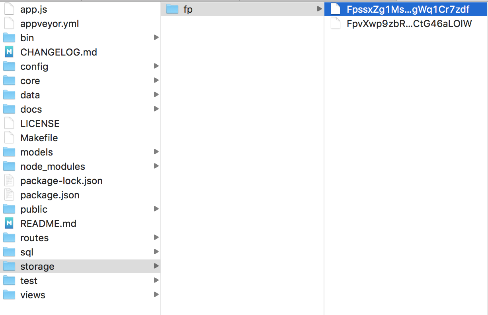
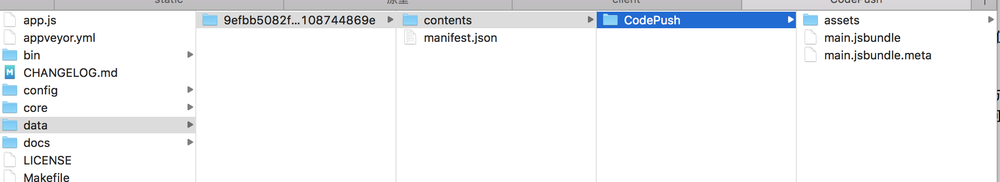
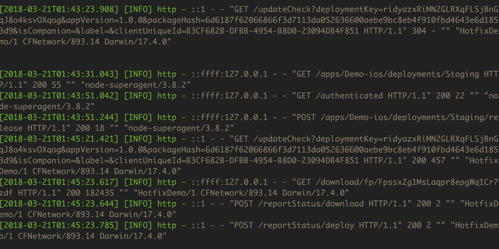

# 私有服务定制

企业生产环境推荐不依赖 Microsoft 提供的公有云 [App Center](https://appcenter.ms/apps)，但是 CodePush 官方目前未提供服务端项目（参考官方答复 [issues/591](https://github.com/Microsoft/react-native-code-push/issues/591)）。

因此建议使用第三方定制的开源私服项目 [lisong/code-push-server](https://github.com/lisong/code-push-server)，因为该项目为国人开发，因此交流和 issue 上报非常方便 [code-push-server/issues](https://github.com/lisong/code-push-server/issues)

在使用以上私服项目前，请首先阅读作者描述的内容 [正确使用 code-push 热更新](https://github.com/lisong/code-push-server#%E6%AD%A3%E7%A1%AE%E4%BD%BF%E7%94%A8code-push%E7%83%AD%E6%9B%B4%E6%96%B0)。

在阅读后续内容前，请保证已经熟悉使用官方提供的 [CodePushCli](https://github.com/Microsoft/code-push/tree/master/cli)，对应 [中文文档地址](https://github.com/Microsoft/code-push/blob/master/cli/README-cn.md)。因为该私服完全依照 SDK 接口实现，与公有云的存储结构没有本质区别。

## 环境搭建

[code-push-server](https://github.com/lisong/code-push-server) 是 Node.js 实现的服务，可以使用经典的 `npm` 源码安装，也可以使用作者封装好的命令行工具 `code-push-server` 直接生成项目。

参考文档，这里本人推荐从源码安装依赖 [#install-from-source-code](https://github.com/lisong/code-push-server#install-from-source-code)，因为该命令行工具涉及的功能点并不多，不建议安装到全局环境。

```
$ git clone https://github.com/lisong/code-push-server.git
$ cd code-push-server
$ npm install
$ ./bin/db init --dbhost localhost --dbuser root --dbpassword #初始化mysql数据库
$ ./bin/www #启动服务 浏览器中打开 http://127.0.0.1:3000
```

注意理解该项目的功能意图和对应的结构，上述的构建流程依赖 MySQL 和 存储地址，下方进行解释。

- 项目依赖 MySQL 环境存储 CodePush 的账户名和密码，用以取代之前在公有云维护的账号信息，启动 MySQL 的相关配置请修改 `config/config.js` 对应 `db` 信息，参考文档 [#config](https://github.com/lisong/code-push-server#config)
- 项目依赖的 __存储地址__ 对应 `config/config.js` 中的 `local` 和 `common` 相关信息，所履行的业务功能是存储打包后的 JS 文件和资源。需要留意的是，该项目支持三种可以管理资源的方式，分别是指定某服务器的文件系统进行管理、阿里云 oss 管理和七牛云管理。
- 项目配置若指定 `config/config.js` 中 `tryLoginTimes` 值大于 0，则开启登录重试次数的限制，默认 0 为不限次数。为防止暴力破解，该项目依赖 Redis 作为管理登录次数的服务，若设置大于 0 的参数前，请启用 Redis 相关服务。

以上服务建议在生产环境下单独提供给业务使用，[MySQL](https://hub.docker.com/_/mysql/) 和 [Redis](https://hub.docker.com/_/redis/) 可以直接从 [DockerHub](https://hub.docker.com/) 获取对应版本资源快速搭建。

## 切换客户端配置

### CodePushCli 配置切换

CodePushCli 使用 Session 文件管理单次会话信息，该文件在运行 `code-push login` 后会记录在 `~/.code-push.config` 内，在 `code-push logout` 后擦除。

需要注意的是，CodePushCli 一次只能保持与一台指定服务间的通讯连接，若要从公有云切换到私有服务，需要在登出后重新登入我方搭建私服的服务器地址。

```
code-push logout
code-push login http://localhost:3000	# 这里以本地搭建私服为例
```

接着会在浏览器打开 code-push-server 提供的登录页面，输入默认的用户名 `admin` 和密码 `123456` 完成登录。注意若要修改初始密码，可以使用 `curl` 或者 `http` 直接通过 API 进行修改。

参考文档 [#code-push-cli](https://github.com/lisong/code-push-server#code-push-cli)。

这样本地客户端保持的通讯地址就切换到了私有服务器，后续的所有操作都会发送到 `http://localhost:3000`

最后在私服中添加我方项目，获取对应 key 即可。

```
code-push app add Demo-ios ios react-native
```

这里以 __Demo-ios__ 为项目名，需要注意的是，code-push-server 定制了后缀规则，必须为 `ios` 或者 `android` 结尾方为合法的项目名称。

### CodePush SDK 配置切换

首先更改 __Info.plist__ 中 `CodePushDeploymentKey` 的值，对应环境的 key 值从上述 CodePushCli 添加应用后返回结果获取。

然后在 __Info.plist__ 文件中添加 `CodePushServerURL` 新的键，对应值为我方私服的地址，这里以 `http://localhost:3000` 为例。这样客户端 App 就可以知晓从何处检测新的版本并获取资源。

参考文档 [#config-react-native-project](https://github.com/lisong/code-push-server#config-react-native-project)

## 发送资源到私服

参考 [使用 CodePush CLI](./usage-cli.md) 中 __推送资源__ 小节的描述，使用 `code-push release-react` 打包上传资源到私服后可以观察到服务端存储资源的位置已经写入了上传的资源和版本信息。（这里以本地 local 为例，分别配置为 storage 和 data）






在应用端交互测试触发更新，可以观察到检测和下载速度有了极大的提升。

在服务端可以实时观察到对应请求信息，留意 `deploymentKey` 是否正确即可。



