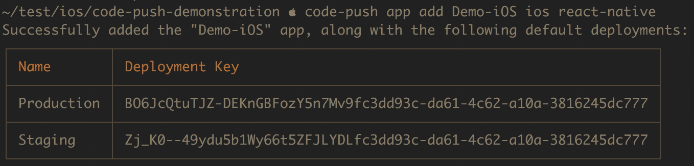
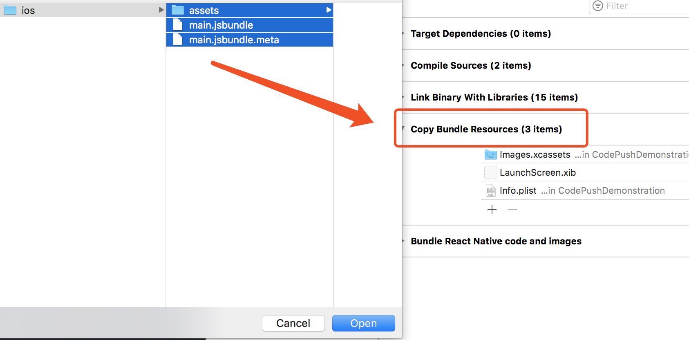
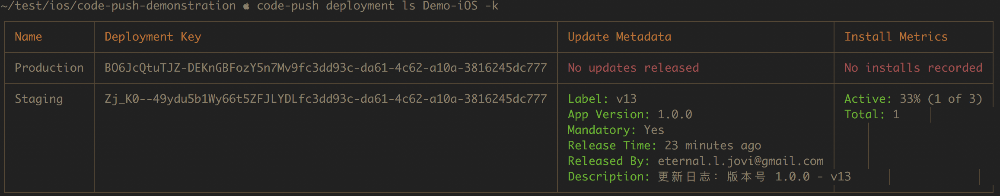

# 使用 CodePush CLI

以下内容细节请参考 [Microsoft/code-push/docs](https://microsoft.github.io/code-push/docs/getting-started.html) 官方文档，以下仅列出必要步骤和核心功能。

## 安装

作为工具使用，建议直接安装到全局。

`npm install -g code-push-cli`

## 账号注册

`code-push register`

## 添加应用

注意，该处添加应用是依赖 Microsoft 提供的公有云 [App Center](https://appcenter.ms)，目前 Code Push 服务端没有官方提供的开放 API 项目，若要搭建私有云，请参考 [lisong/code-push-server](https://github.com/lisong/code-push-server)。

在 App Center 指定平台和实现（因为除了 react-native，Code Push 还提供对 Cordova 的支持）依赖参数，我们以 Demo-[ iOS | Android ] 作为我们的应用名称。

```
code-push app add Demo-iOS ios react-native
code-push app add Demo-Android android react-native
```

注意返回的 Deployment Key，这里以我本地测试为示例。



## 本地打包测试（debug 模式）

一般情况下，不建议在 debug 模式中测试热修复，相比之下 release 模式更加接近 code push 模拟的环境，不过如果一定要测试，就需要先打包到本地，然后切断 RN 的服务，在 debug 环境中进行热修复调试。

1. 首先打包资源

  需要注意的仅仅是 __entry-file__ 的参数要与入口 RN 文件吻合，输出的名字尽可能使用 `[.jsbundle]` 后缀，最后就是输出资源的路径。

  ```
  react-native bundle --entry-file='index.js' --bundle-output='./bundles/ios/main.jsbundle' --dev=false --platform=ios --assets-dest='./bundles/ios'
  ```

2. 在 Xcode 中添加资源

  如图所示，注意不要以逻辑目录的形式添加 groups，要以 __Create folder references__ 保持引用和物理目录结构的一致性，否则 RN 无法寻找到输出的图片资源。

  

3. 切断 RN 本地服务

  `RCTBundleURLProvider sharedSettings` 接口可以做到两件事情，当本地没有打包好的资源时，访问 RN 本地调试服务器获取 `dev=true` 模式下的 JS 和资源文件；反之，直接加载已经添加到应用中的资源。

## 推送资源

推送资源基于你完成了某次版本之后，准备推送到 App Center 或者私服云，直接使用 code push cli 完成本地打包并上传的工作。

请参考下方示例命令。

```
code-push release-react Demo-iOS ios -m --description "更新日
志：版本号 1.0.0 - v13""
```

注意 `release-react` 会大幅度优化 JS 代码和资源文件，可以简单理解为 JS 端的一层优化方式，方法其实等价于 webpack 相关操作。

`-m` 参数直接影响本地发布的资源是否是强制的，也会影响到 react-native-code-push 在 JS 中获取到的参数。

`--description` 可以配合产品完成一些于客户端展示更新日志的工作，可以以交互的形似展示给用户，让用户了解到本次更新的内容。

之后再次运行 `code-push deployment ls Demo-iOS -k` 便可以清楚的查询到本次更新发布的信息。下方依然以 __Demo-iOS__ 作为示例。



## 版本号

接着引用上图，其中关键性信息有 __Label__ 和 __App Version__。

需要注意的是，code push 更新的资源版本管理一定是基于 Native App 中的二进制版本为主，以上图为例便是基于 `1.0.0` 这个版本进行线性迭代，无论中间是否有回滚操作，__Label__ 的编号总是增量的，可以借鉴 git 的版本控制中 `revert` 的原理。