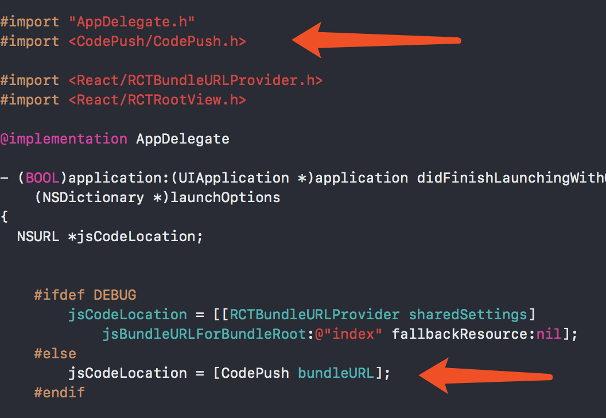
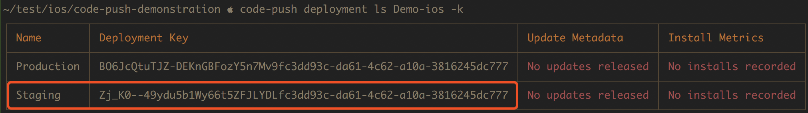
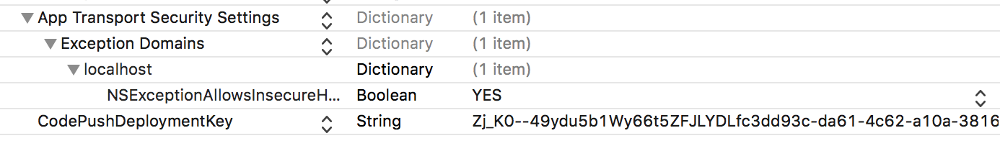

# 使用 CodePush SDK

## 可以解决的问题

- 版本差异化检测
- 增量更新
- 多环境测试
- 灰度发布覆盖
- 灾难回滚机制

## 无法解决的问题

- 无法更新 JS 中调用到 Native 端未提供的功能接口

  也就是说热修复的定位场景依然是 bug 修复和小功能迭代，不适用于大版本更新。定期发布二进制到 Appstore 是不可以完全避免的，也不能滥用热修复妄图解决所有问题。
  
## 可覆盖的 RN assets 组件和对应属性


| Component                                       | Prop(s)                                  |
|-------------------------------------------------|------------------------------------------|
| `Image`                                         | `source`   |
| `MapView.Marker` <br />*(Requires [react-native-maps](https://github.com/lelandrichardson/react-native-maps) `>=O.3.2`)* | `image`                             |
| `ProgressViewIOS`                               | `progressImage`, `trackImage`            |
| `TabBarIOS.Item`                                | `icon`, `selectedIcon`                   |
| `ToolbarAndroid` <br />*(React Native 0.21.0+)* | `actions[].icon`, `logo`, `overflowIcon` |

## 集成安装

请参考 [Microsoft/react-native-code-push#setup-ios](https://github.com/Microsoft/react-native-code-push/blob/master/docs/setup-ios.md)

这里建议使用 `npm` 或者 `yarn` 直接进行依赖获取，使用 `react-native-cli` 进行静态库的链接。

1. 依赖获取 - RN 根目录下运行

  `npm i --save react-native-code-push`
  
2. 依赖集成到 Native 端并链接静态库

  `react-native link react-native-code-push`

## 配置

使用 `react-native link` 会直接触发完成该步骤。



__这里需要注意几处细节__

`jsCodeLocation = [CodePush bundleURL];` 仅默认 RN 方面的 JS bundle 文件名为 `main.jsbundle`，如果项目中另外更改了 JS bundle 的资源名，需要调用以下两个相应接口获取到最新的热修复资源。

```
bundleURLForResource:	// 名字更改，后缀仍为 [.jsbundle]
bundleURLForResource:withExtension:	// 名字和后缀均更改 
```

然后在 Info.plist 中配置 `CodePushDeploymentKey`。

运行 cli 获取相应环境的 key。（这里先以 Staging 环境为例）

```
code-push deployment ls Demo-ios -k
```





最后需要注意的是，如果希望在测试环境中请求我方支持的服务域名，需要加入可以信任的协议后才能生效。
引用官方文档 [http-exception-domains-configuration-ios](https://github.com/Microsoft/react-native-code-push/blob/master/docs/setup-ios.md#http-exception-domains-configuration-ios)